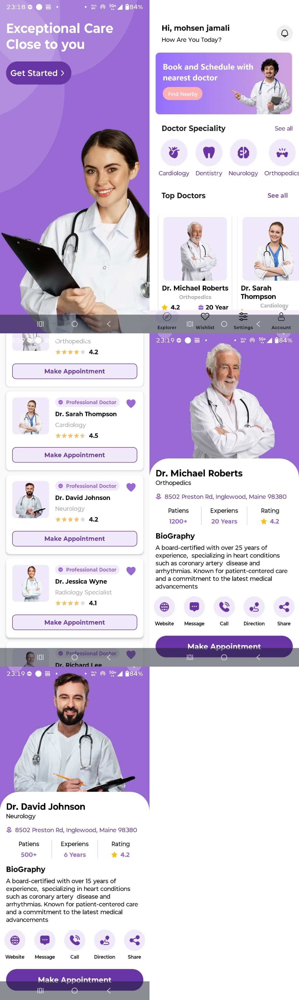

# Dr. Appointment (Android App)

**Made by - Vikash Kumar (NIT Jamshedpur)**

## 📋 Overview

Dr. Appointment is a native Android app built with Kotlin + Jetpack Compose that helps users discover doctors by specialty, browse top doctors, and view detailed profiles. Users can sign in as Doctor or Patient, search doctors by specific category, book appointments (patients), and view role-specific account profiles with upcoming appointments.

## 🎯 Purpose

Make it quick and easy to find the right doctor, review details, and contact or navigate to them.

---

## ✨ Core Functionalities

1. Browse doctors by specialty categories
2. View **top doctors** with ratings and experience
3. Open doctor profile details (bio, stats, reviews)
4. Quick actions: call, SMS, directions, website, share
5. Book appointments as patient (date/time picker; saved to Firebase; shown in upcoming appointments)
6. Role-based authentication (Doctor and Patient sign-up and login with separate flows)
7. Search doctors by specific category (inbuilt specializations; tap category to see filtered doctor list)
8. Account screens with read-only profile and upcoming appointments list (for both Doctor and Patient)
9. Offline-friendly UI state with cached lists
10. Firebase realtime data loading
11. Smooth navigation between screens 
12. Material 3 UI with Compose
13. Personalized home greeting ("Hi, &lt;User Name&gt;")

---

## 🛠️ Tech Stack (Points)

- Kotlin
- Jetpack Compose + Material 3
- MVVM (ViewModel + LiveData)
- Firebase Realtime Database
- Navigation Compose
- Coil (image loading)
- Firebase Authentication (role-based: Doctor / Patient)
- Gradle + Android Studio

---

## 🏗️ Technical Perspective

- MVVM architecture with `MainViewModel` exposing `LiveData` for UI state
- `AccountViewModel` and `AppointmentViewModel` for profile data and booking; appointments stored in Firebase `Appointments` node
- Single-shot Firebase reads (`addListenerForSingleValueEvent`) with in-memory caching flags
- Firebase Auth with role stored in DB (`UserRoles`, `DoctorIds`); `AppNavGraph` handles auth redirect and post-login flow
- Compose-first UI, split by feature modules (intro, home, detail, top doctors, auth, account, doctors-by-specialization)
- Navigation graph centralized in `AppNavGraph` with route helpers
- Resource-driven UI (drawables, fonts, colors, strings)

---

## 🌟 Key Features

### 👨‍⚕️ Doctor Discovery

- Category-based browsing
- Search doctors by specific category (inbuilt specializations with icons; doctors-by-specialization screen)
- Top doctor list with ratings
- Detailed profile view

### 🔐 Authentication & Roles

- Role selection (Doctor or Patient) before sign-up/login
- Separate Doctor and Patient login and sign-up screens
- Post-login redirect to home; post-sign-up redirect to login
- User roles and doctor IDs stored in Firebase

### 📅 Appointments

- Book appointment from doctor detail (patients only; date/time picker; saved to Firebase)
- Upcoming appointments list on Patient and Doctor account screens

### 👤 Account & Profiles

- Read-only Doctor profile (name, email, specialization, phone, experience, location, bio, website) and upcoming appointments
- Read-only Patient profile (name, phone, email) and upcoming appointments
- Back button to Home from account

### 📞 Actions & Sharing

- Call, message, and directions
- Website and share links

### 🧭 UI & Navigation

- Compose-only UI
- Clean navigation graph

### 💾 Data & Sync

- Firebase Realtime Database (Categories, Doctors, UserRoles, DoctorIds, Appointments)
- Efficient one-time fetches with caching

---

## 📱 App Screenshots

---

## 📄 License

Vikash Kumar
National Institute of Technology Jamshedpur

